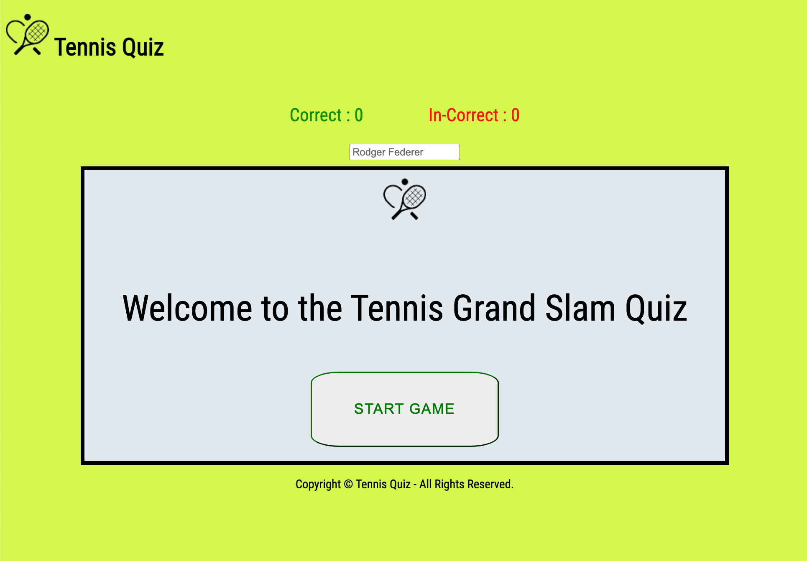
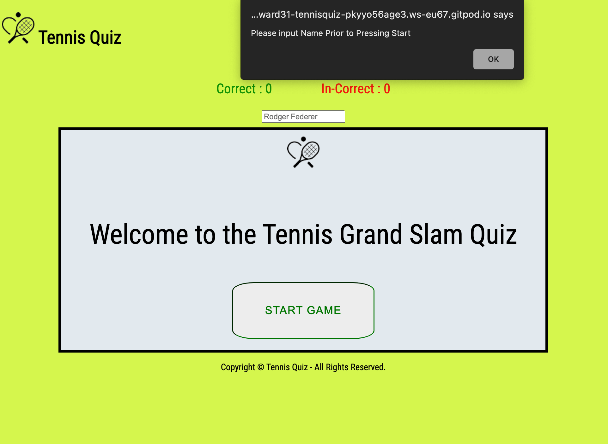
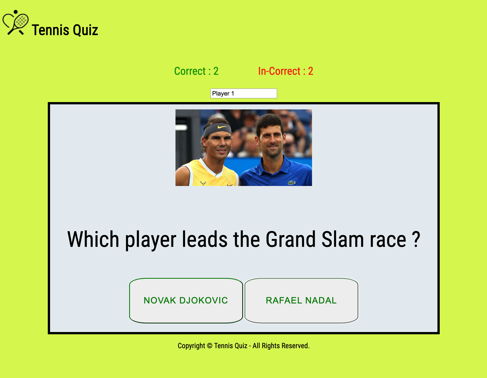
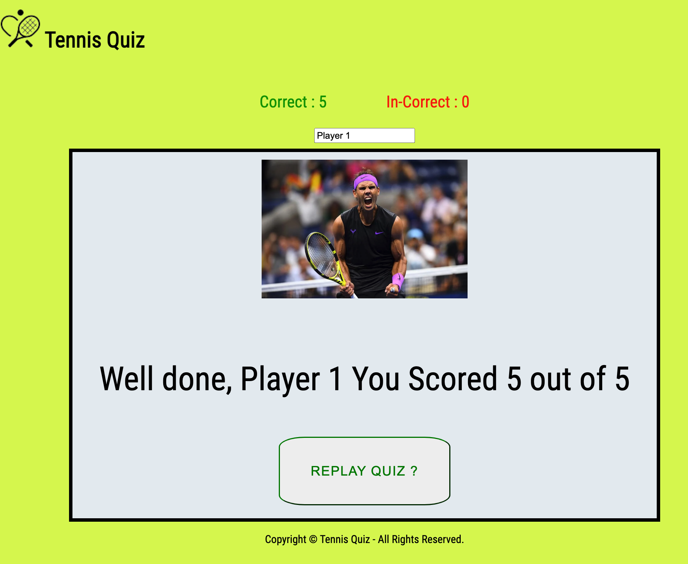
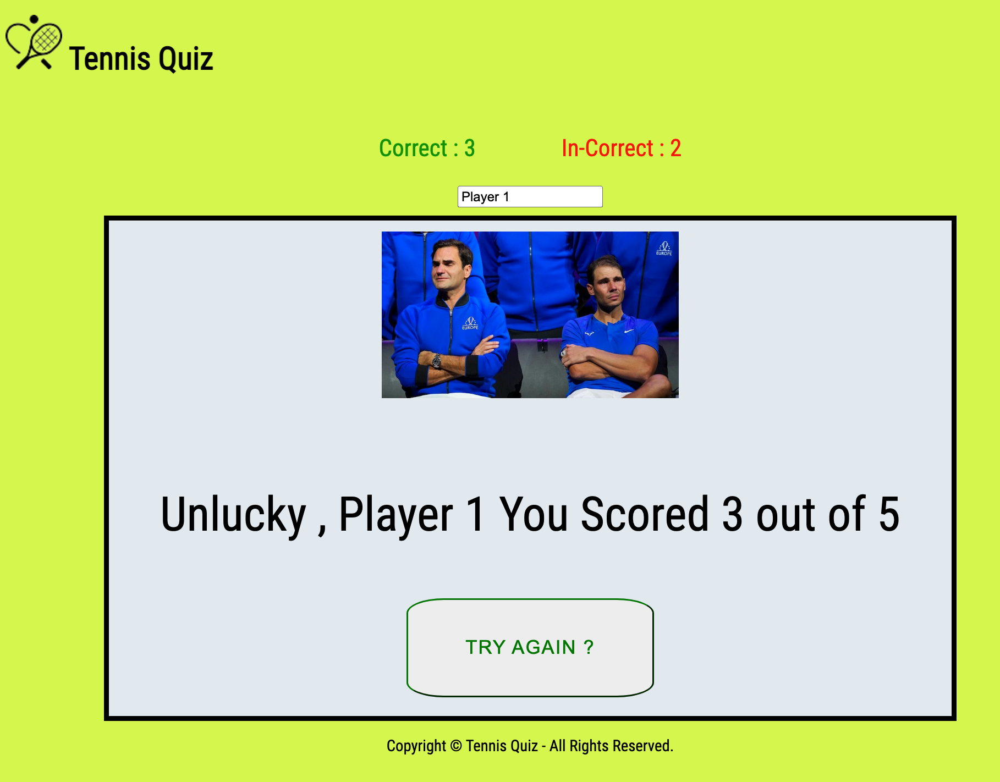

# Tennis Quiz Online Game 

This application was create to test users general knowledge on tennis.  

The page's purpose is to create a fun interaction via the use of questions and score keeping to allow the user to know there results at the end. 

The App is designed to be bright, colourful, fun and simple to interact with. This is achieved by some features such as 

- Tennis images that relate to the questions being asked.
- Dramatic tennis related images to the end result.
- Simple interaction via the pressing of oversized buttons.
- Clear Concise score keeping that is coloured in a familar way. 
- Username input so that the program responds to the user by their inputted name. 

--- 

# Screen shots

Start Screen

  

Name Failed to Be Input

  

Score Board - Score Keeping

  

Postiive Outcome

  

Negative Outcome

  

--- 
# Javascript Coding 

- Switch / Case used to handle the Sequncing through the quiz 

- Cases included some of the following features

   - Text change for different questions 
   - Image changes per respective questions 
   - Answer changes on the Push buttons 
   - Loading of the Correct answer to be referenced when calculating the score 
   - Case 101 : used to create alert in name is not entered prior to pressing start 

- Case Excerpt 

      switch (qSeq) { 

         /* Case 0 -  Intro/Welcome -   */
    
          case 0:

            document.getElementById('question-text').textContent = "Welcome to the Tennis Grand Slam Quiz";
         

           break;

- Onclick used via the html buttons to call functions defined buttons fucntions that registerd the answer as correct or incorrect and then ran the sequence to index through the quiz 

- Console Logging Used 

The below Function was use to log and track data via the console log -  This allowed me to follow the code and the data creation/flow and esure correct data was being created as the user interacted.

function logData(){
    
    console.log(`qSeq = ${qSeq}`);
    console.log(`good count = ${gCount}`);
    console.log(`bad count = ${bCount}`);
    document.getElementById('correct-a').textContent = `Correct :  ${gCount}`;
    document.getElementById('incorrect-a').textContent = `In-Correct :  ${bCount}`;

---
# Deployment 

For deploymet, I used git hub pages. This "Pages" feature in the settings allows for deloyment of small/medium projects. 

---

# Validation 

## J shint - Validator Results Report 

Metrics
There are 8 functions in this file.

Function with the largest signature take 0 arguments, while the median is 0.

Largest function has 15 statements in it, while the median is 3.

The most complex function has a cyclomatic complexity value of 12 while the median is 1.5.

One undefined variable  
169	uname
Three unused variables
177	sButton
198	aButton
207	bButton

###  !!! Please Note These "unused" Variables are used in the HTML !!!

## W3 code Validator 

This validator was run and some minor errors were rectified. 

## CSS Code Validator Jigsaw

This validator was run and no erros were present.

---

# Screen Size Testing 

The Pages where tested at different resulutions via google chrome inspect dev tools toolbar. 
Using Inspect Dev tools Project was tested the following pixel ranges 400px, 800px, 1200px and above.

Frontend was found to be adequately responsice at the above measuring criteria. 

---

# Multi Browser Check 

Pages checked on multiple broswers namely, Chrome, firefox and Safari.  

https://www.w3schools.com/js/js_comparisons.asp

---
 
# Credits 

The following websites/orgs where extremely helpful in assiting with my understanding of what is requried and inspiration for what is the standard for this type of website.

---

## Technical assitance credits 

W3 School

https://www.w3schools.com/js/js_comparisons.asp

https://www.w3schools.com/tags/tag_input.asp

Stack Over flow -

https://stackoverflow.com/questions/6115801/how-do-i-test-if-a-variable-does-not-equal-either-of-two-values

https://stackoverflow.com/questions/11563638/how-do-i-get-the-value-of-text-input-field-using-javascript

https://stackoverflow.com/questions/17814926/java-switch-statement

https://stackoverflow.com/questions/11563638/how-do-i-get-the-value-of-text-input-field-using-javascript
---

## images Credits 

lastwordonsports.com
lavercup.com 
tennisoworld.de
wimbledon.com

---

### Other mentions

Special thanks for Samantha Dartnall for her assistance and guidance throughut the project. 